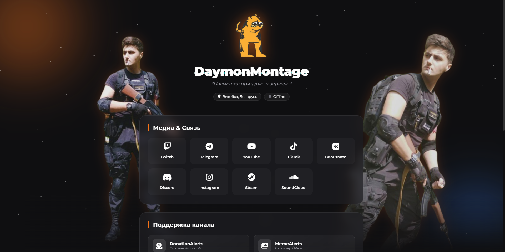
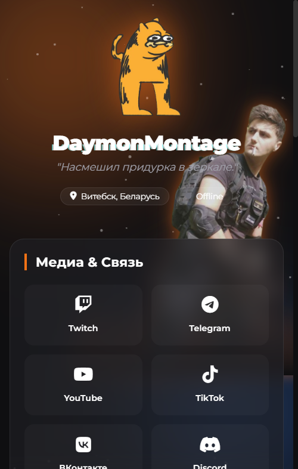

# 🟠 DaymonMontage | Streamer Hub

> **"Насмешил придурка в зеркале."**

Профессиональный, атмосферный сайт-визитка (Link-in-Bio) для стримера **DaymonMontage**.
Выполнен в стилистике игры _Voices of the Void_ с использованием современных веб-технологий, темной темы и эффекта стекломорфизма.

---

## 🖼️ Демонстрация

|                        Desktop Version                        |                            Mobile Version                             |
| :-----------------------------------------------------------: | :-------------------------------------------------------------------: |
|  |  |

---

## 🛠️ Технологический стек

Проект написан на чистом коде (Vanilla), без использования тяжелых фреймворков, что обеспечивает моментальную загрузку.

-  **HTML5** - Семантическая верстка.
-  **CSS3** - Grid, Flexbox, Animations, Media Queries.
-  **JavaScript (ES6+)** - Логика плеера, API, эффекты.
- **Twitch Embed API** - Встраивание плеера.
